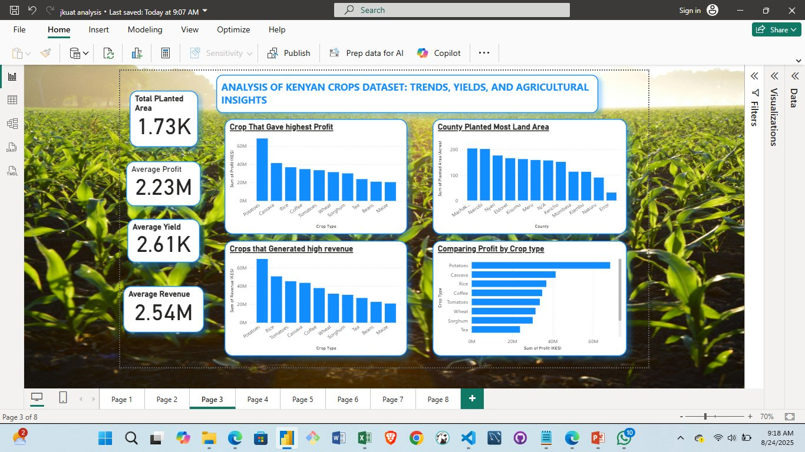
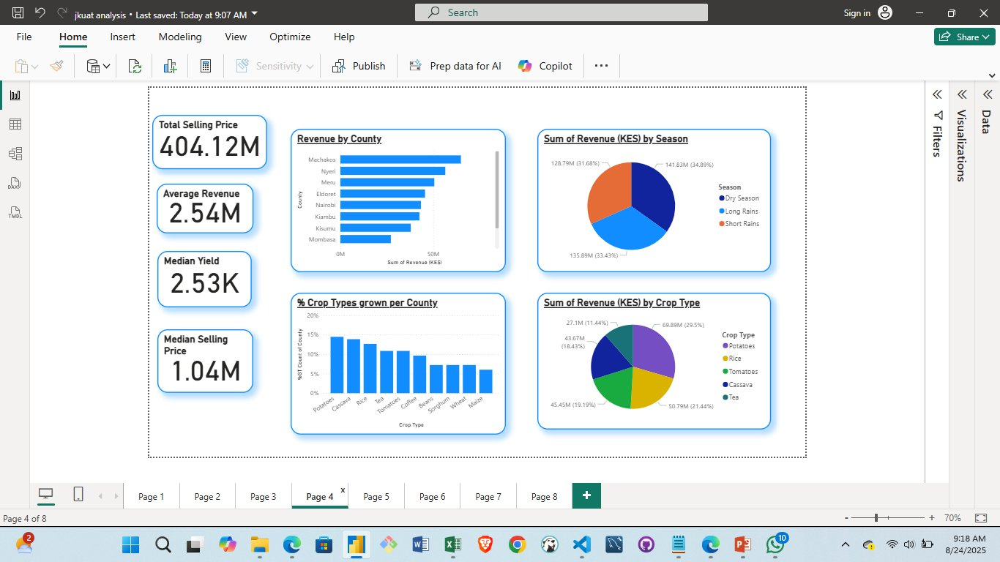
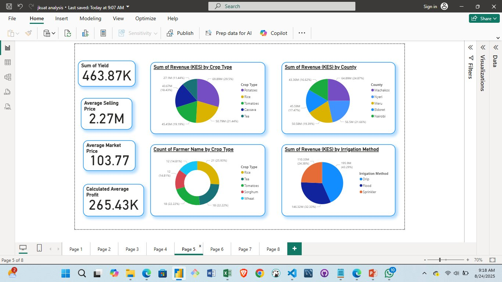
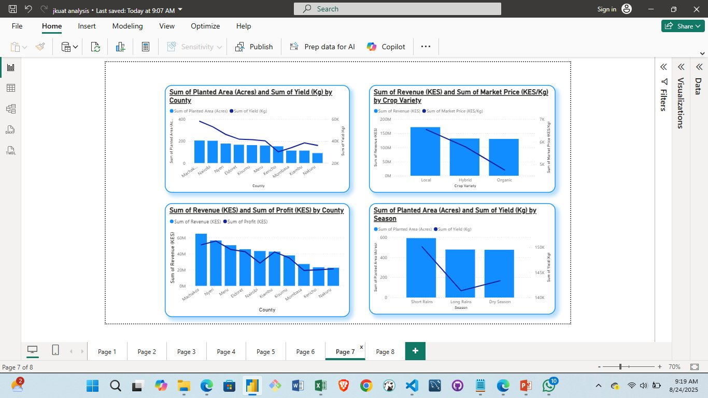
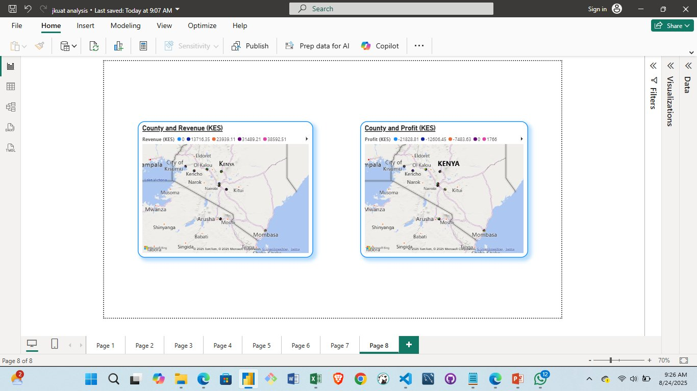

# Kenyan Crops Data Analysis

A comprehensive data analysis of crop production, profitability, land use, irrigation, soil types, and seasonal trends across Kenyan counties using real agricultural datasets.

## Key Insights & Findings

### Most Profitable Crops
- **1st**: Potatoes 🥔  
- **2nd**: Cassava  
- **3rd**: Rice  

### Top Revenue-Generating Crops
- Cassava, Potatoes, and Rice dominate national agricultural revenue.

### Leading Counties in Revenue
- **Machakos and Nyeri counties lead in total agricultural revenue, driven heavily by potatoes, cassava, and rice.

### Land Allocation Leaders
- Nairobi and Machakos counties allocate the largest land area to crop production.

### Seasonal Revenue Contribution
- Dry season → 35%  
- Long rains → 33%  
- Short rains → 31%

### Highest Yield Crops
- Potatoes and Rice recorded the highest average yields per hectare.

### Irrigation Impact on Profitability
| Irrigation Method | Profit Share |
|-------------------|--------------|
| Drip irrigation   | 43% ⭐       |
| Flood irrigation  | 32%          |
| Sprinkler         | 24%          |

> **Insight**: Drip irrigation delivers the highest profitability — a clear opportunity for investment.

### Soil Types & Revenue
- Clay, loam, and sandy soils support the highest agricultural revenue.

### Top Fertilizers Used
- CAN and DAP are the most widely applied fertilizers and show strong correlation with higher revenue and yields.

### Monthly Revenue Trends
- Peak months: **March, April, May** (harvest season)  
- Lowest month: **August** – impacted by pest infestations, delayed planting, and adverse weather

### Long-Term Profit Trends
Profits show seasonal fluctuations but remain resilient in high-demand crops (potatoes, cassava, rice).

## Key Recommendations
1. Prioritize investment in potatoes, cassava, and rice — Kenya’s profitability backbone.
2. Scale drip irrigation adoption for maximum ROI.
3. Optimize fertilizer use (especially CAN & DAP) based on soil type.
4. Strengthen pest management and climate-resilient practices, especially ahead of August lows.
5. Support farmers in Machakos, Nyeri, Nairobi with extension services and market linkages.

## Partners
@LuxDevHQ 

## 📌 Repository Contents
- `data/` – Raw and cleaned datasets   
- `visualizations/` – Charts and dashboards  
- `README.md` – Project overview (you’re here!)

---
## visuals

